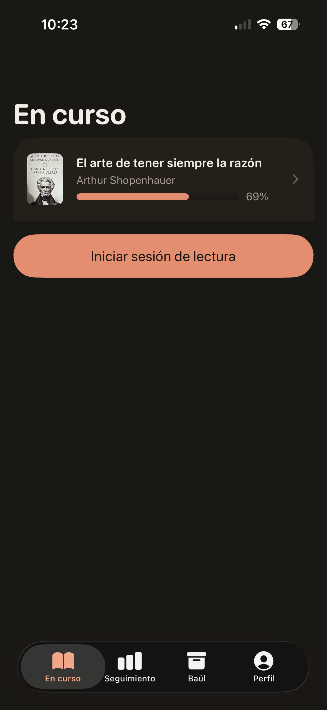
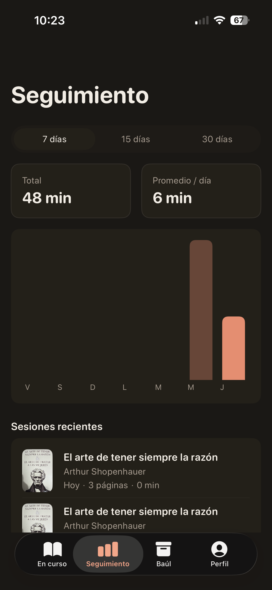
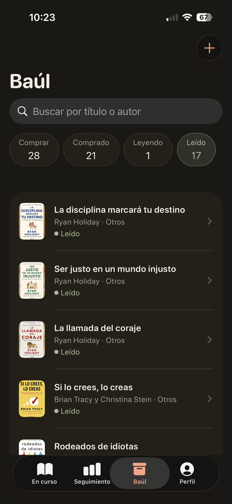
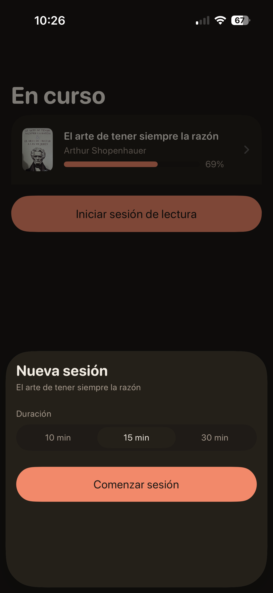
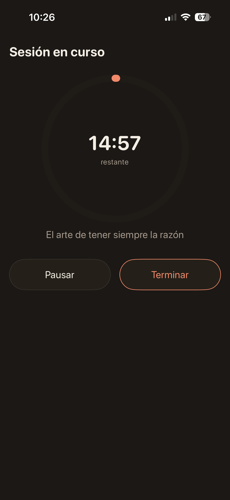

# Tomoteca

App nativa de iOS para llevar una biblioteca personal: registrar los libros que quieres leer o
comprar, seguir su estado y cronometrar las sesiones de lectura.

Todo se guarda en local con Core Data. Sin cuentas, sin backend, sin dependencias de terceros.

## Qué hace

Tres pestañas:

| Pestaña | Contenido |
|---|---|
| **En curso** | Los libros que estás leyendo. Punto de entrada a la sesión de lectura. |
| **Seguimiento** | Gráfica de tiempo leído por día, con rango de fechas. |
| **Baúl** | El registro completo: lista, búsqueda, alta, detalle. |

Cada libro tiene un título, autor, género, número de páginas, portada opcional y un estado dentro
de su ciclo de vida (*quiero comprar* → *comprado* → *leyendo* → *leído*), que solo avanza:
no hay marcha atrás.

Una sesión de lectura se lanza con una duración configurable. Cuando se acaba el tiempo, la app
avisa y pregunta por la página en la que te quedaste; con eso se actualiza el avance del libro.

## Capturas

<table>
  <tr>
    <td width="33%"></td>
    <td width="33%"></td>
    <td width="33%"></td>
  </tr>
  <tr>
    <td align="center"><b>En curso</b></td>
    <td align="center"><b>Seguimiento</b></td>
    <td align="center"><b>Baúl</b></td>
  </tr>
  <tr>
    <td width="33%"></td>
    <td width="33%"></td>
    <td width="33%"></td>
  </tr>
  <tr>
    <td align="center"><b>Nueva sesión</b></td>
    <td align="center"><b>Sesión en curso</b></td>
    <td></td>
  </tr>
</table>

## Stack

- **Swift 5 / SwiftUI**, iOS 16.0, solo iPhone, solo vertical.
- **Combine** para el flujo reactivo entre capas.
- **Core Data** como único almacenamiento.
- **Swift Testing** en tests unitarios, XCTest en UI tests.
- Sin dependencias de terceros: solo SDKs de Apple.

Arquitectura MVVM organizada por feature, con un design system propio (tokens → componentes →
pantallas) y toda la interfaz localizada en español e inglés.

## Compilar y probar

**Requiere Xcode 26 o superior.** La interfaz se localiza con los símbolos generados del String
Catalog (`STRING_CATALOG_GENERATE_SYMBOLS`), que no existen en versiones anteriores: con un Xcode
más antiguo el proyecto no compila.

```bash
# Compilar
xcodebuild -scheme tomoteca -destination 'platform=iOS Simulator,name=iPhone 17' build

# Solo los tests unitarios (rápidos, ~1s)
xcodebuild -scheme tomoteca -destination 'platform=iOS Simulator,name=iPhone 17' \
  -only-testing:tomotecaTests test

# La suite completa, UI tests incluidos (varios minutos)
xcodebuild -scheme tomoteca -destination 'platform=iOS Simulator,name=iPhone 17' test
```

Cada push a `master` compila el proyecto y pasa los tests unitarios en CI. La suite completa se
lanza a mano desde la pestaña Actions.

## Documentación

| Qué | Dónde |
|---|---|
| Cómo se comporta la app hoy: producto, dominio, estados | [`docs/features/README.md`](docs/features/README.md) |
| Por qué llegó a comportarse así, un archivo por cambio | [`docs/cambios/`](docs/cambios/) |
| Cómo se construyó la v1, hito a hito | `docs/features/hito-*.md` |
| Diseño de pantallas y mockups | [`docs/design/README.md`](docs/design/README.md) |
| Arquitectura y reglas de código | [`CLAUDE.md`](CLAUDE.md) |

## Licencia

[MIT](LICENSE) © 2026 Sergio Pinilla
